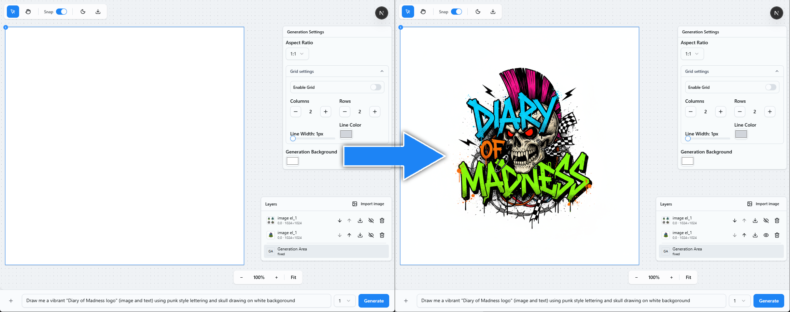
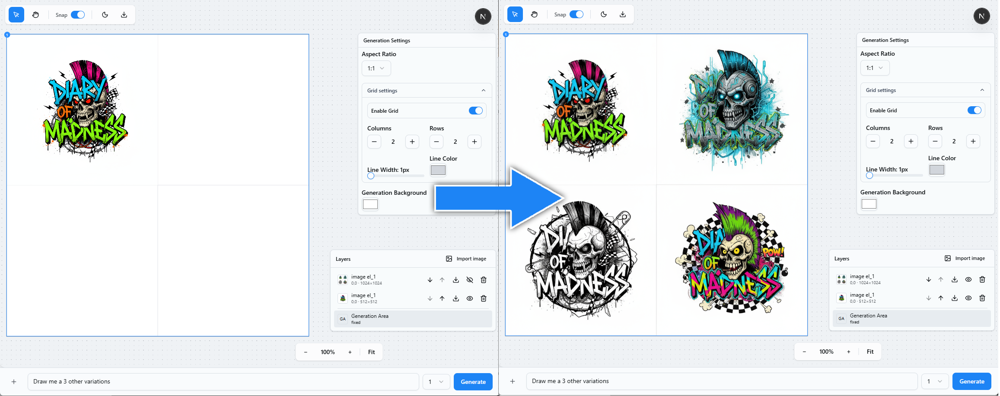
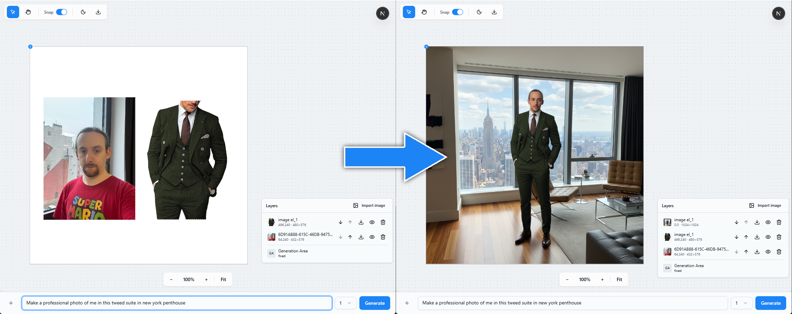

# Vibrant Wave Editor

**Vibrant Wave** is an AI-powered **canvas editor** where **what you see on the canvas is the main conditioning signal** for generation.

Every time you hit **Generate**, the app takes the **visible composition** inside the *Generation Area*, optionally mixes in your **extra reference images**, adds your **text prompt**, sends it to the image LLM — and returns the result as a **new layer** on top.

> Mental model: **WYSIWYP — What You See Is Your Prompt.**
> You “author” the prompt with layers, masks and framing — not only with text.

> **Model stack (current):** Requests go through **OpenRouter** and are executed by **nano-banana** (our image-LLM relay). The model is swappable later; today we default to `google/gemini-2.5-flash-image-preview` via OpenRouter, executed through nano-banana.

## What you can do in 10 seconds

* **Outpaint empty borders** — expand the frame, hit **Generate**, the white areas fill in contextually.
* **Local fix (Inpaint)** — paint a mask over a region and regenerate just that area.
* **Style lift** — drop 1–2 style refs, adjust prompt, get a tasteful new layer.
* **Quick variants** — set `variantCount: 3–4`, keep the best, hide the rest.

## Examples

### Example 1: Basic Generation

*Standard AI image generation from text prompts*

### Example 2: Grid Generation

*Filling a grid with variations based on reference examples*

### Example 3: Canvas Composition

*Combining elements on canvas - dressing a person in a suit and creating a photo*

---

## Quickstart

### 1. Get OpenRouter API Key
1. Go to [OpenRouter.ai](https://openrouter.ai)
2. Sign up/login and go to [API Keys](https://openrouter.ai/keys)
3. Create a new API key (starts with `sk-or-...`)
4. Copy the key for the next step

### 2. Setup Environment
Create `.env.local` in project root:
```env
# Required: paste your OpenRouter API key here
OPENROUTER_API_KEY=sk-or-your-key-here

# Optional: override default model (default: google/gemini-2.5-flash-image-preview)
OPENROUTER_IMAGE_MODEL=google/gemini-2.5-flash-image-preview
```

### 3. Install Dependencies
```bash
bun install
```

### 4. Run Development Server
Choose your platform:

**Windows:**
```cmd
run_win.bat
```

**macOS:**
```bash
./run_mac.sh
```

**Linux:**
```bash
./run_linux.sh
```

**Manual (any platform):**
```bash
bun run dev
```

App runs on `http://localhost:3000` by default.

### 5. Build & Deploy
```bash
bun run build
bun run start
```

---

## Scripts
```json
{
  "dev": "next dev --turbopack",
  "build": "next build --turbopack",
  "start": "next start",
  "lint": "eslint"
}
```
Run with Bun:
```bash
bun run dev
bun run build
bun run start
```

---

## API
Endpoint: `POST /api/generate`

Body (JSON):
```json
{
  "prompt": "cinematic portrait, warm lighting",
  "canvas": "data:image/png;base64,....",
  "attachments": ["data:image/png;base64,...."],
  "model": "google/gemini-2.5-flash-image-preview",
  "variantCount": 3
}
```

Behavior:
- Server resizes input images to ~1MP using `sharp` (keeps aspect) for efficient LLM input.
- Calls OpenRouter chat completions with image+text modalities.
- Returns up to `variantCount` image URLs and combined textual output.

Response (shape):
```json
{
  "variants": [
    { "image": "https://...", "text": "...optional text..." }
  ],
  "text": "Combined text across variants",
  "image": "https://..." // first image for convenience
}
```

---

## Development Tips
- **UI Components**: shadcn/ui primitives in `src/components/ui`
- **Canvas Tools**: Konva-based components in `src/components/canvas` and `src/components/Canvas*`
- **State Management**: Zustand stores in `src/lib` for settings, history, and canvas state
- **Command Pattern**: undo/redo system with commands in `src/lib/commands`
- **Hotkeys**: global keyboard shortcuts in `src/lib/useGlobalHotkeys`
- **Theme**: CSS custom properties with dark/light mode support

---

## Deployment
Any Next.js-compatible host works (Vercel recommended).
- Set environment variables (`OPENROUTER_API_KEY`, optional `OPENROUTER_IMAGE_MODEL`).
- Build with `bun run build` or via the host’s build step.
- Ensure serverless runtime can fetch `https://openrouter.ai/api/v1/chat/completions`.

---

## Troubleshooting
- **Missing API key**: `OPENROUTER_API_KEY` not set → API returns 500 with explicit error
- **Sharp issues**: on Windows, update Node/Bun and reinstall deps (`rm -rf node_modules && bun install`)
- **Empty variants**: check model quota and ensure input images are valid data URLs
- **Canvas not loading**: check browser console for Konva/React-Konva errors
- **Hotkeys not working**: ensure focus is on canvas, not input fields

---

## License
MIT
